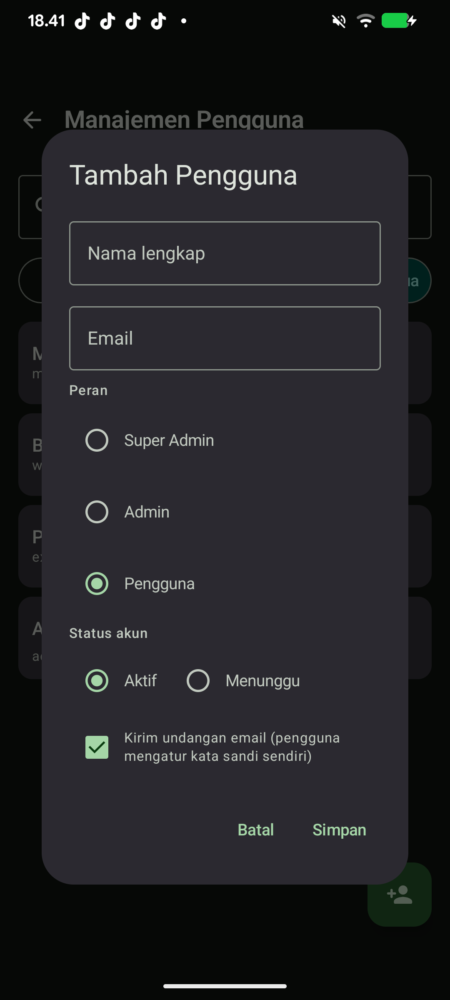
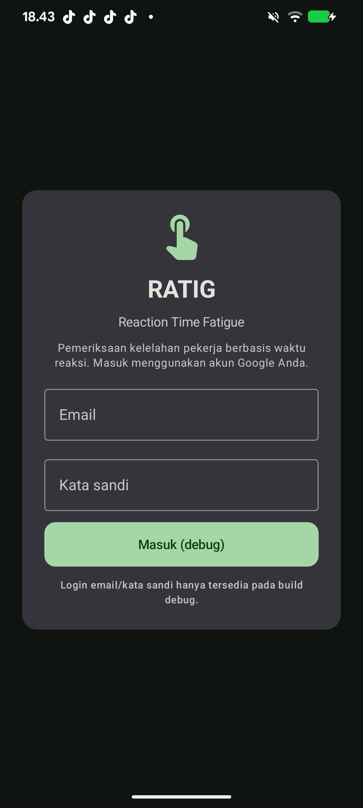
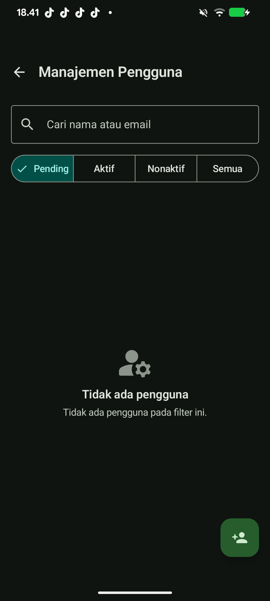
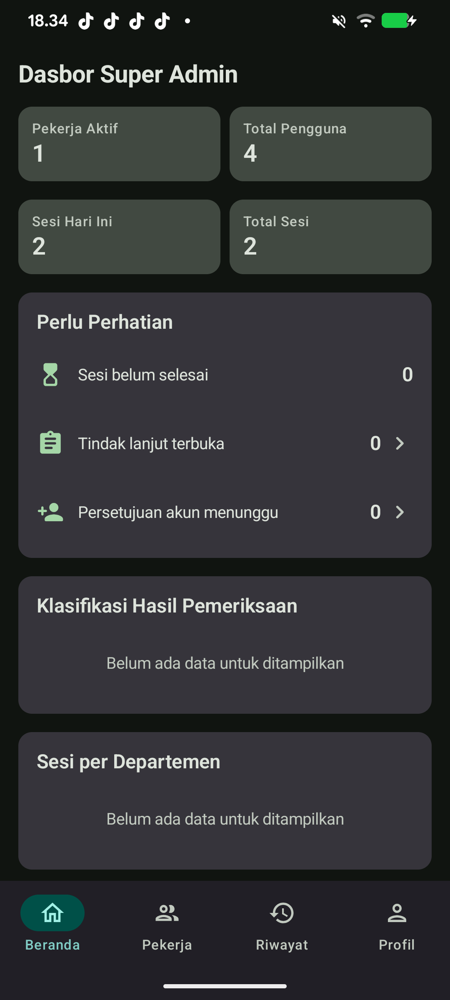
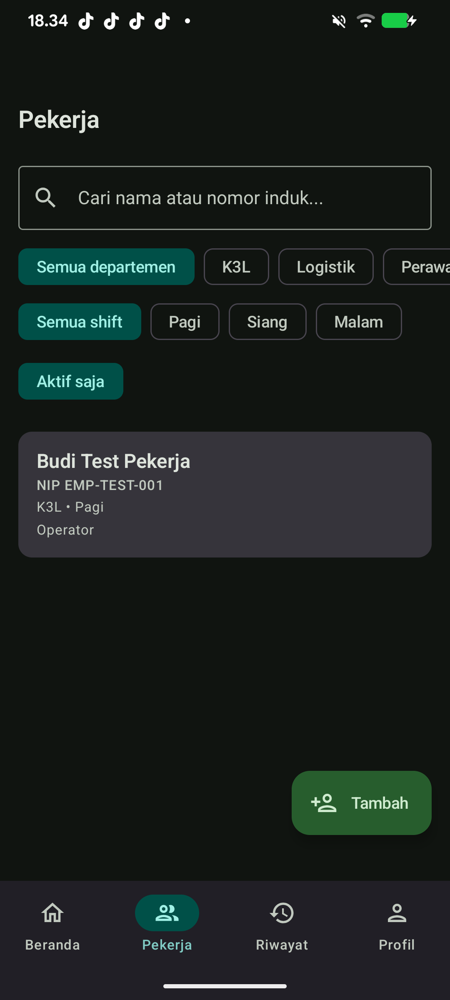
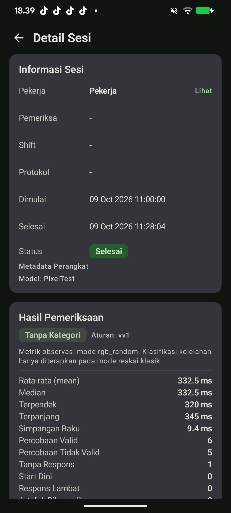
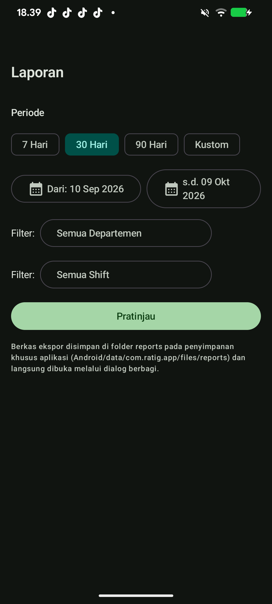
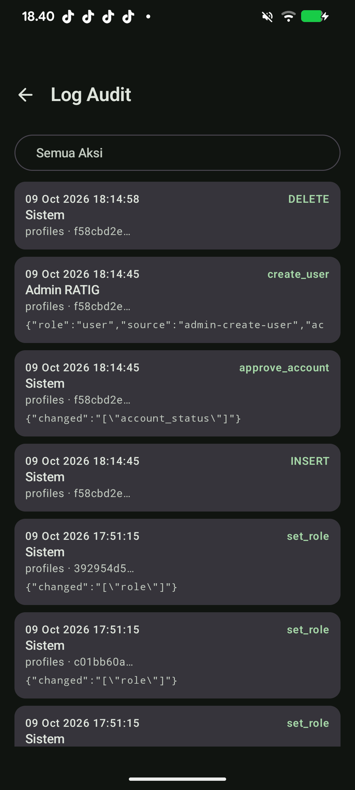
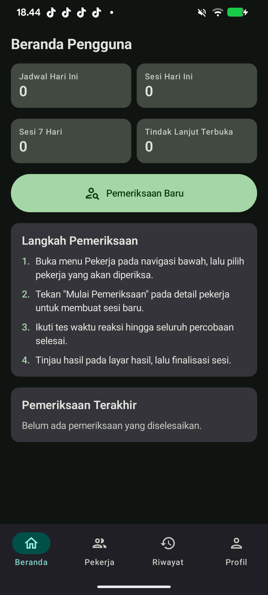

# Proposal Proyek RATIG

**Sistem Pemeriksaan Kelelahan Berbasis Waktu Reaksi**

---

## Perkenalan Kelompok

Proposal ini disusun oleh kelompok yang terdiri dari **3 orang**:

| No | Nama | Peran | NIM |
|---|---|---|---|
| 1 | _Nama Anggota 1_ | Ketua / Android Developer | _0000000001_ |
| 2 | _Nama Anggota 2_ | UI/UX & Backend | _0000000002_ |
| 3 | _Nama Anggota 3_ | Pengujian & Dokumentasi | _0000000003_ |

> Ganti nama, peran, dan NIM di atas sesuai data kelompok Anda.

---

## Ringkasan Singkat

RATIG adalah aplikasi Android untuk memeriksa tingkat kelelahan pekerja
melalui pengukuran **waktu reaksi** (reaction time). Pemeriksaan berlangsung
hanya beberapa menit, hasilnya langsung muncul, dan seluruh data tersimpan
aman di server. Aplikasi tetap berfungsi **tanpa internet** sehingga dapat
digunakan di area tambang, pabrik, atau lokasi kerja terpencil.

> **Prinsip utama:** RATIG adalah **alat bantu keputusan** bagi pemeriksa
> (paramedis/SHE). Hasil RATIG tidak menggantikan penilaian medis dan tidak
> menjadi keputusan akhir kelayakan kerja — keputusan tetap mengikuti SOP
> perusahaan dan penilaian pemeriksa yang berwenang.

---

## 1. Latar Belakang

Kelelahan (fatigue) adalah salah satu penyebab utama kecelakaan kerja di
industri. Kelelahan menurunkan kewaspadaan, memperlambat pengambilan
keputusan, dan meningkatkan risiko kesalahan. Sayangnya, kelelahan sering
tidak terdeteksi karena:

- Sifatnya subjektif — pekerja sering merasa "masih kuat" padahal refleks
  sudah menurun.
- Pemeriksaan manual memerlukan waktu dan tenaga, serta hasilnya sulit
  dibandingkan antar-waktu.
- Pencatatan masih kertas/spreadsheet, sulit dipantau secara menyeluruh.

**RATIG menjawab masalah ini** dengan pengukuran objektif, cepat, dan
terdokumentasi otomatis.

---

## 2. Tujuan

1. **Mendeteksi dini** penurunan kondisi pekerja melalui waktu reaksi.
2. **Mempercepat** proses pemeriksaan: satu petugas dapat memeriksa banyak
   pekerja pada satu perangkat.
3. **Mendokumentasikan** hasil secara rapi, aman, dan dapat diaudit.
4. **Memantau** tren kelelahan per departemen, shift, dan waktu.
5. **Menjaga privasi** pekerja (data pribadi dilindungi dan dibatasi aksesnya).

---

## 3. Cara Kerja (Sederhana)

```
Pekerja datang  →  Petugas pindai NIK/QR  →  Pekerja mengerjakan tes
      →  Hasil muncul seketika  →  Data tersimpan & tersinkron otomatis
```

1. **Identifikasi** — petugas memindai barcode/QR atau mengetik NIK pekerja
   (NIK tetap disamarkan di layar demi privasi).
2. **Pemeriksaan** — pekerja menyelesaikan tes waktu reaksi singkat.
3. **Hasil** — aplikasi menampilkan hasil dan klasifikasi (mis. "Normal",
   "Perlu perhatian") berdasarkan aturan yang disetujui perusahaan.
4. **Penyimpanan** — data langsung tersimpan di perangkat, lalu terkirim ke
   server begitu ada internet.

---

## 4. Fitur Utama

### 4.1 Empat Mode Pemeriksaan

| Mode | Deskripsi | Cocok untuk |
|---|---|---|
| **Klasik (RGB)** | Stimulus warna, reaksi paling cepat | Pemeriksaan kelelahan standar |
| **Warna Acak** | Stimulus warna acak | Variasi & meminimalkan hafalan |
| **Tombol Acak** | Mencari target di grid tombol | Koordinasi mata–tangan |
| **Inhibisi (Go/No-Go)** | Menahan diri pada stimulus tertentu | Kontrol fokus & impuls |

> Hasil mode Klasik yang dipakai untuk klasifikasi kelelahan. Mode lain
> memberi **data pengamatan** (akurasi, kelalaian) dan **tidak** digabung
> menjadi satu skor — agar penilaian tetap jelas dan tidak menyesatkan.

### 4.2 Akurat & Adil

- Waktu diukur dengan **jam monotonik** (bukan jam dinding), sehingga hasil
  tetap akurat meskipun perangkat lambat atau waktu sistem berubah.
- Data yang tidak wajar (mis. gangguan perangkat) otomatis ditandai dan
  **tetap tercatat** untuk keperluan audit — tidak ada data yang dihapus
  diam-diam.

### 4.3 Tetap Berfungsi Tanpa Internet (Offline-First)

- Pemeriksaan dapat dijalankan **tanpa sinyal sama sekali**.
- Data tersimpan aman di perangkat dan **otomatis tersinkron** saat kembali
  online.
- Halaman **Status Sinkronisasi** menunjukkan: data mana yang sudah terkirim,
  sedang dikirim, atau perlu perhatian.
- Login tetap mungkin dilakukan dalam batas waktu tertentu saat offline.

### 4.4 Identifikasi Cepat dengan NIK

- Petugas **login sekali**, lalu memeriksa banyak pekerja satu per satu.
- Pencarian pekerja lewat **pemindai kamera** (barcode/QR) atau **input manual NIK**.
- NIK adalah **kunci identitas** pekerja; tampilannya selalu disamarkan
  (mis. `3201**********99`) agar tidak bocor di layar atau log.

### 4.5 Keamanan & Privasi Berlapis

- Hak akses diatur **per peran** dan ditegakkan di server (bukan hanya di
  aplikasi), sehingga tidak dapat dilewati.
- **Kunci layanan (service key) tidak pernah disimpan di aplikasi** — aman
  walau APK diperiksa.
- Hasil yang sudah final bersifat **permanen (tidak dapat diubah)** untuk
  menjaga keaslian data.
- Setiap tindakan penting (persetujuan akun, perubahan peran) tercatat di
  **log audit**.

### 4.6 Tiga Peran Pengguna (Masing-masing Punya Halaman Sendiri)

| Peran | Halaman & Tugas |
|---|---|
| **Super Admin** | Semua: kelola admin & pengguna, data master, protokol, aturan, pemantauan penuh |
| **Admin** | Kelola pengguna + **pemantauan**: jumlah pengguna, persetujuan akun, sesi, tindak lanjut, tren |
| **Pengguna** | Menjalankan tes dan melihat riwayat pemeriksaan sendiri |

### 4.7 Manajemen Pengguna (Tambah Akun)

- Super Admin / Admin dapat **menambah pengguna** langsung dari aplikasi
  (tombol **+** di halaman Pengguna).
- Isi: nama, email, peran, status.
- Dua cara membuat akun:
  - **Undangan email** — pengguna mengatur kata sandi sendiri (disarankan).
  - **Kata sandi sementara** — akun langsung aktif.
- **Pengaman**: hanya Super Admin yang boleh membuat akun Admin; Admin biasa
  hanya membuat akun Pengguna. Email ganda ditolak otomatis.



### 4.8 Pemantauan & Laporan (Dashboard Admin)

- **Ringkasan**: pekerja aktif, total pengguna, sesi hari ini, total sesi.
- **Perlu perhatian**: sesi belum selesai, tindak lanjut terbuka, persetujuan
  akun menunggu.
- **Analitik**: distribusi klasifikasi hasil, sesi per departemen, sesi per
  shift, dan tren 14 hari.
- **Ekspor**: laporan CSV untuk keperluan manajemen.

---

## 5. Manfaat yang Diharapkan

| Sebelum | Sesudah memakai RATIG |
|---|---|
| Pemeriksaan manual, hasil subjektif | Pengukuran objektif & konsisten |
| Sulit memantau seluruh pekerja | Dashboard pemantauan real-time |
| Data di kertas/spreadsheet | Data digital, otomatis, dan dapat diaudit |
| Bergantung jaringan | Tetap berjalan offline |
| Risiko data pribadi tersebar | Privasi terlindungi berlapis |

---

## 6. Ruang Lingkup

**Termasuk dalam proyek ini:**
- Aplikasi Android (offline-first) untuk pemeriksaan & identifikasi.
- Backend aman (basis data, autentikasi, aturan akses, fungsi server).
- Manajemen pengguna & pemantauan untuk Admin/Super Admin.
- Dokumentasi teknis dan panduan penerapan.

**Di luar lingkup:**
- Perangkat keras khusus/IoT (RATIG murni perangkat Android).
- Diagnosis medis otomatis (RATIG hanya alat bantu keputusan).
- Integrasi ke sistem HR/payroll (dapat menjadi tahap lanjutan).

---

## 7. Kebutuhan

| Kategori | Kebutuhan |
|---|---|
| Perangkat | Ponsel/tablet Android (kamera untuk pemindai QR) |
| Akun | Akun Google untuk masuk (atau akun yang dibuat Admin) |
| Jaringan | Internet opsional (untuk sinkronisasi) |
| Pendukung | SOP klasifikasi kelelahan yang disetujui perusahaan |

---

## 8. Tahapan Pelaksanaan

1. **Persiapan** — konfigurasi server, pendaftaran akun Google, data awal
   (departemen, shift, protokol).
2. **Penerapan** — pemasangan aplikasi di perangkat pemeriksa, pelatihan
   singkat petugas.
3. **Uji Coba** — pemeriksaan perdana pada sejumlah pekerja, penyesuaian
   aturan klasifikasi sesuai SOP.
4. **Operasional** — penggunaan rutin + pemantauan melalui dashboard.
5. **Evaluasi** — tinjauan berkala dan penyempurnaan.

---

## 9. Ukuran Keberhasilan

- Pemeriksaan selesai dalam **hitungan menit** per pekerja.
- **≥ 95%** data pemeriksaan berhasil tersinkron tanpa intervensi manual.
- Dashboard menampilkan kondisi terkini **setiap hari**.
- Tidak ada kebocoran data pribadi; seluruh akses sesuai peran.
- Hasil dapat diaudit dan ditelusuri kapan pun.

---

## 10. Galeri Antarmuka

Berikut tangkapan layar utama aplikasi (Material 3). Seluruh gambar tersimpan
di folder `docs/proposal/ui/`.

**Masuk & Manajemen Pengguna**





**Dasbor Super Admin**



**Operasional Pemeriksaan**





**Analitik & Administrasi**





**Pengalaman Pengguna**



> Galeri lengkap 21 layar tersedia dalam `RATIG-UI-Gallery.pdf`.

## 11. Penutup

RATIG dirancang agar **sederhana bagi pengguna, kuat di belakang layar**.
Petugas cukup memindai dan menjalankan tes; keamanan, akurasi, dan
pencatatan ditangani otomatis. Dengan RATIG, pemeriksaan kelelahan menjadi
lebih cepat, objektif, dan dapat dipantau secara menyeluruh — mendukung
lingkungan kerja yang lebih aman.

---

*Dokumen ini adalah ringkasan proposal. Untuk detail teknis, lihat
`README.md`, `docs/architecture.md`, `docs/deployment.md`, dan
`docs/oauth-setup.md`.*
